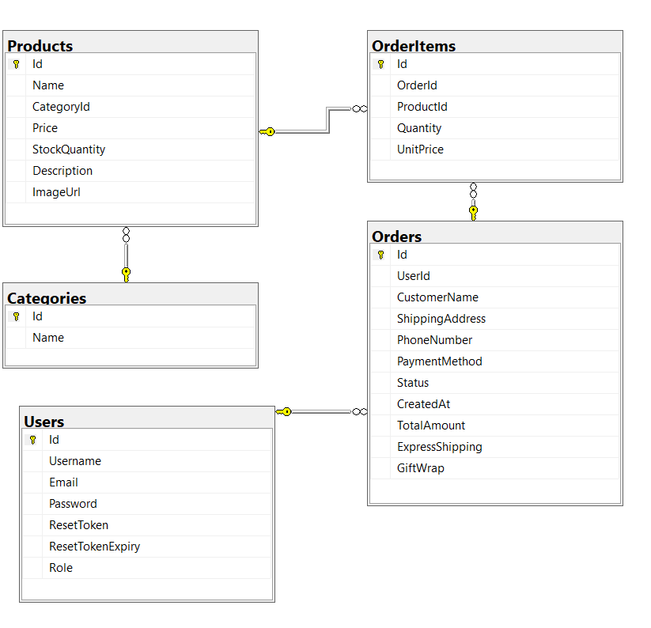

## SQL cũ

## Kiểm tra lại Chức năng.

**Các chức năng đã thực hiện**

-Hiển thị sản phẩm kèm hình ảnh

-Có mô tả chi tiết

-Lọc sản phẩm theo tên

-Thêm giỏ hàng

-Phân loại sản phẩm

-Thanh toán

-Lịch sử đơn hàng

-Thống kê doanh thu theo ngày

-Sản phẩm bán chạy

-Quản lý người dùng

-Quản lý đơn hàng

-Thanh toán QR

**Các chức năng chưa thực hiện**

-UI chưa đẹp mắt, tối ưu, gọn gàng

-Giao diện thông tin khách hàng

-Thống kê doanh thu chi tiết các ngày

-Thống kê theo quý - năm

-Dịch vụ chăm sóc khách hàng

-Hủy hàng bên khách hàng

-Gợi ý các sản phẩm có liên quan trong tìm kiếm

-Thanh toán QR thực

## Nâng cấp và mở rộng CSDL

- Tinh chỉnh các bảng hiện tại

**Bảng Products:**

- Thêm cột BrandId (Khóa ngoại): Đồ công nghệ luôn gắn liền với thương hiệu (Apple, Samsung, Sony...).

- Thêm cột DiscountPrice (hoặc SalePrice): Thường xuyên có các chương trình giảm giá, bạn cần một cột để hiển thị giá gốc (gạch chéo) và giá khuyến mãi.

- Thêm cột Slug: Hỗ trợ SEO thân thiện trên thanh URL (ví dụ: /san-pham/iphone-15-pro-max).

**Bảng Orders:**

- Nên tách trạng thái thanh toán và trạng thái giao hàng. Hãy thêm cột PaymentStatus (Pending, Paid, Failed) bên cạnh cột Status (Processing, Shipped, Delivered) hiện tại.

- Đề xuất thêm các bảng mới

**Bảng Brands (Thương hiệu):*** Gồm: Id, Name, LogoUrl.

*Lý do:*Cho phép người dùng lọc sản phẩm theo hãng (Ví dụ: Chỉ xem Laptop Dell).

**Bảng ProductImages (Thư viện ảnh sản phẩm):**

Gồm: Id, ProductId (FK), ImageUrl, IsPrimary.

*Lý do:*Hiện tại bảng Products của bạn chỉ có 1 cột ImageUrl. Thực tế mỗi chiếc điện thoại hay laptop cần một bộ sưu tập (gallery) gồm nhiều góc chụp khác nhau.

**Bảng ProductVariants (Biến thể sản phẩm - Rất quan trọng cho đồ công nghệ):**

Gồm: Id, ProductId (FK), Color, Storage (ROM), RAM, AdditionalPrice, StockQuantity.

*Lý do:*Một chiếc iPhone 15 sẽ có bản 128GB, 256GB và các màu khác nhau. Giá tiền và số lượng tồn kho của từng bản cũng khác nhau. Bảng này sẽ giải quyết triệt để vấn đề đó.

**Bảng Reviews (Đánh giá & Bình luận):**

Gồm: Id, ProductId (FK), UserId (FK), Rating (1-5 sao), Comment, CreatedAt.

*Lý do:*Tăng độ tin cậy cho cửa hàng. Giảng viên rất thích các chức năng có tính tương tác này.

**Bảng Coupons / Promotions (Mã giảm giá):**

Gồm: Id,`Code`, DiscountPercent (hoặc DiscountAmount), ExpiryDate, UsageLimit.

*Lý do:*Dùng để áp dụng mã giảm giá lúc Checkout, giúp luồng thanh toán phức tạp và thực tế hơn.

## Kế hoạch nâng cấp

Tuần 1: Cải thiện Giao diện & Chuẩn bị nền tảng dữ liệu

Tuần 2: Quản lý Hồ sơ & Trải nghiệm Hủy đơn

Tuần 3: Tối ưu Tìm kiếm & Gợi ý & Thanh toán trực tuyến thực tế

Tuần 4: Tính năng Voucher

Tuần 5: Nâng cấp chức năng cho Quản trị viên (Admin)

Tuần 6: Dịch vụ Chăm sóc Khách hàng

Tuần 7: Kiểm thử (Testing) & Hoàn thiện Báo cáo